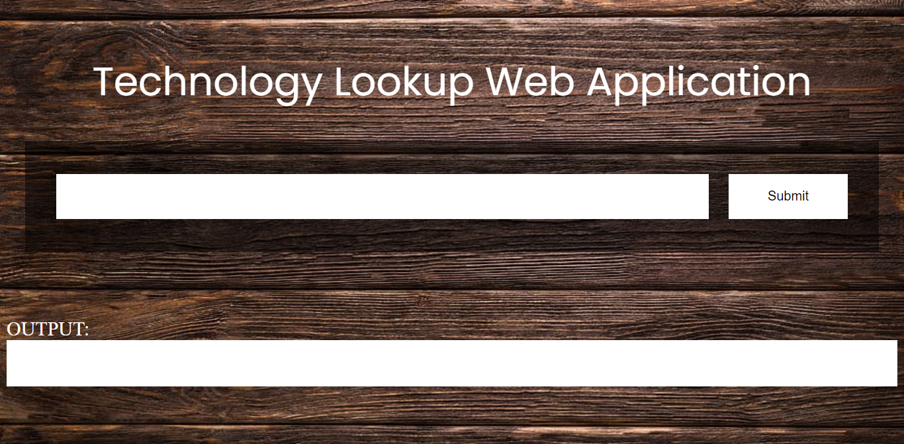

<h1 align="center">Technology Lookup Web Application</h1>

<i>You'll get to know what all technologies a webpage is using.</i>

  

 

<i>Want to connect? See you at <a href="https://www.linkedin.com/in/sahilrahman/">LinkedIn</a></i>

 
This repo aims to find all the technologies that a specific website is using.

  
<h2 style="display: inline-block">Contents</h2>

  <ol>
    <li>
      <a href="#about-the-project">About The Project</a>
      <ul>
        <li><a href="#built-with">Built With</a></li>
      </ul>
    </li>
    <li>
      <a href="#getting-started">Getting Started</a>
      <ul>
        <li><a href="#installation">Installation</a></li>
      </ul>
    </li>
    <li><a href="#contact">Contact</a></li>
  </ol>

## About The Project

### Built With

* Python
* Pandas
* BeautifulSoup
* Requests
* Flask
* WTForms

## Website

Link : https://awesome-github-readme-profile.netlify.app

## :man_astronaut: Show your support

Give a ⭐️ if this project helped you!
